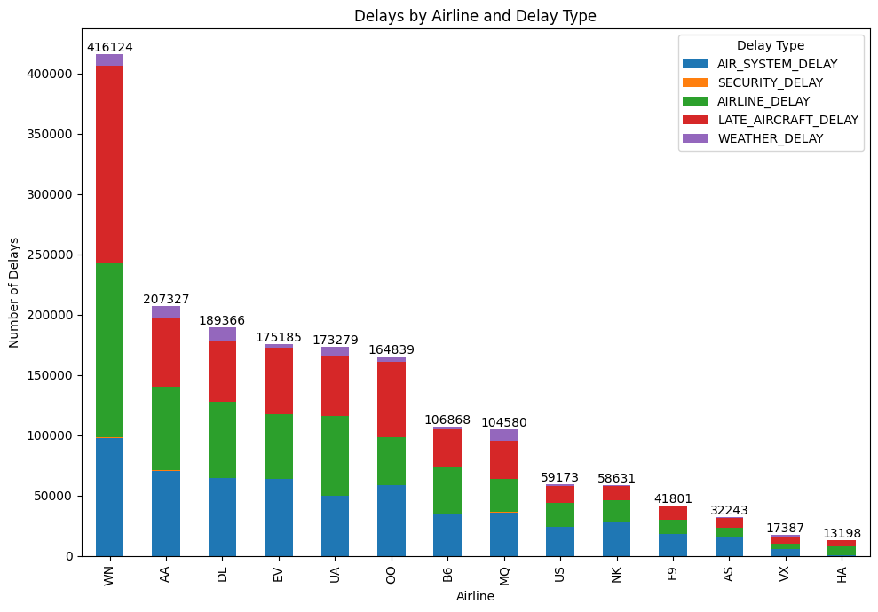
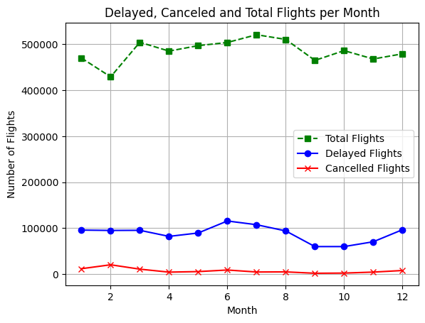
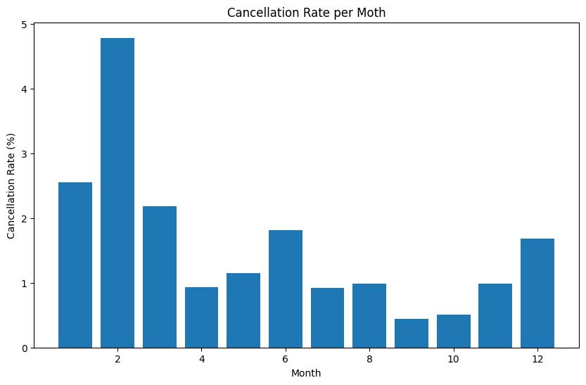
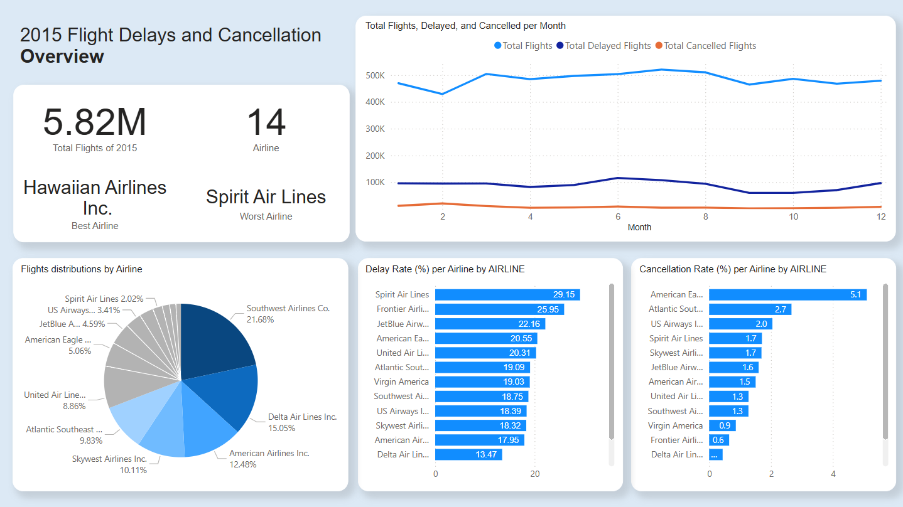
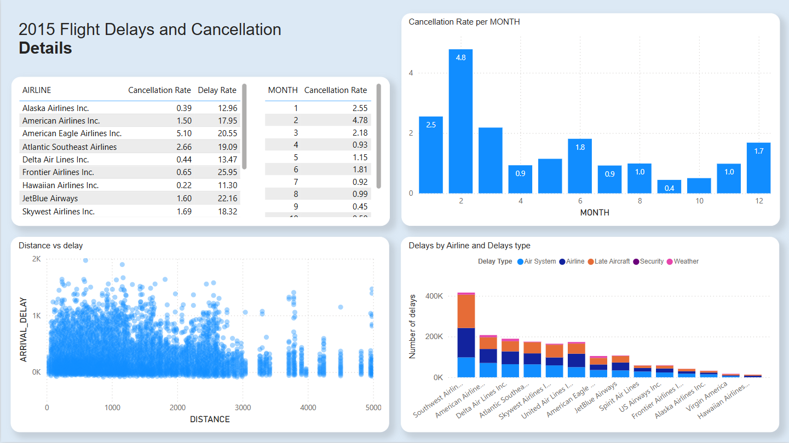

# 2015 Flight Delays and Cancellations Analysis

### Project Overview
This data analysis project explores [the "2015 Flight Delays and Cancellations" dataset from Kaggle](https://www.kaggle.com/datasets/usdot/flight-delays), which contains flight information for the year 2015, including details about flight delays, cancellations, and causes. The goal is to identify patterns, understand cancellation and delay trends, and provide insights into the best airlines and months to fly with minimal disruptions.

____

### Goals and Objectives
1. **Understand Fligth Cancellations and Delays:**
    - Analyze which airline and months have the highest/lowest cancellation and delay rates
2. **Identify Patterns:**
    - Examine the relationship between flight distance and delays
    - Investigate how flight trends vary by month
3. **Insights for Travelers:**
    - Recommend the best airlines and months for flying

____

### Dataset
**Source:** [Kaggle - 2015 Flight Delays and Cancellations](https://www.kaggle.com/datasets/usdot/flight-delays) 
The dataset includes three raw CSV files:
1. **airlines.csv** Provides information about airlines, including IATA_CODE and airline name.
2. **airports.csv** Contain details about airports, such as the airport's name, city, and country.
3. **flights.csv** The main dataset, detailing individual flights including departure and arrival times, delays, cancellation, and more.

____

### Process
1. **Data Cleaning**
    - Data Transformation
        - Converted time-related columns (e.g., SCHEDULED_DEPARTURE) into a readable format (e.g., 0508 instead of 50.8)
        - Split the dataset into two subsets: **delayed_flights** and **cancelled_flights** for more focused analysis

 

2. **Exploratory Data analysis (EDA)**  
Visualization and statistical methods were used to explore trends in flight data.
Key charts include:
- **Pie Chart:** Distribution of flights by airline in 2015.
- **Stacked Bar Chart:** Delayed by airline and delay type, sorted by the most delayed airline.

- **Scatter Plot:** Relationship between flight distance and arrival delay.
- **Line Chart:** Monthly trends in total fligths, delays, and cancellations.

- **Bar Charts:**
    - Cancellation rates by airline.
    - Delay rates by airline.
    - Cancellation rates by month.
    

> "Additional charts and visualizations generated during EDA can be found in the **EDA_charts** folder."

 

3. **Keys Insights**  
- **Flight Distribution**: Southwest Airlines had the most flights in 2015, while Virgin America had the fewest.  
- **Delays by Airline**: Southwest Airlines had the highest total delays (416,124), with delays categorized by type.  
- **Delay Rate**: Hawaiian Airlines had the lowest delay rate (11%), while Spirit Airlines had the highest (29%).  
- **Cancellation Rate**: Hawaiian Airlines had the lowest cancellation rate (0.2%), while Envoy Air had the highest (5%).  
- **Distance vs. Delay**: Longer flights generally had fewer arrival delays, indicating better scheduling efficiency.  
- **Monthly Delays**: May-July and November-December had the highest delays due to seasonal demand.  
- **Monthly Cancellations**: February had the highest cancellation rate (4%), likely due to weather, while September had the lowest (0.4%).  

___

### Dashboard

___

### Tools
**Programming Language:** Python  
**Visualization Tool:** Power BI (for dashboard)  
**Libraries:** pandas, matplotlib